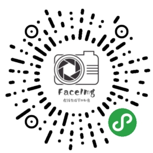
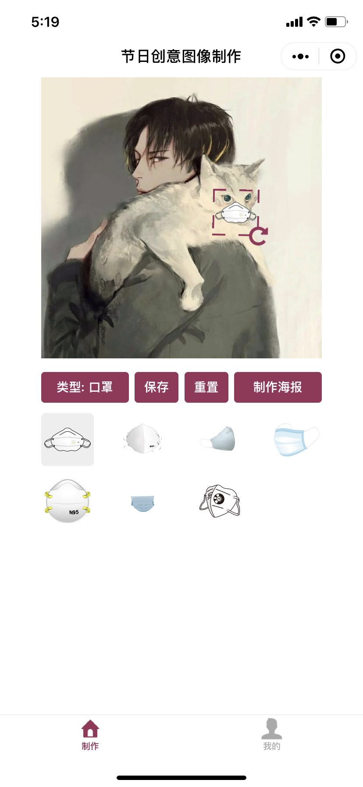
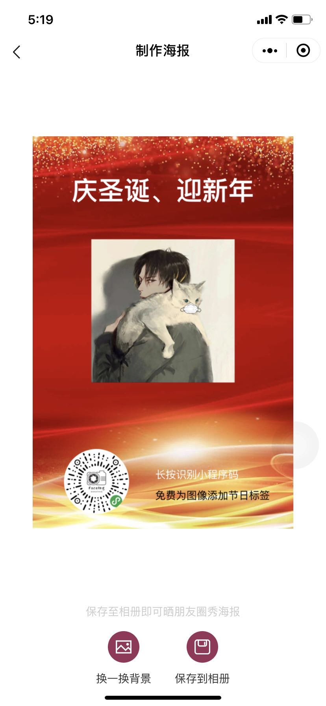

<!--
 * @Author: agoni
 * @Date: 2020-2-24 16:39:05
 * @LastEditTime : 2020-2-24 16:39:05
 -->
# face-img

[](https://raw.githubusercontent.com/attentiveness/whcapp/master/LICENSE)

开源一个完整微信小程序app，已经上线了名称《头像节日生成》
主要功能：给头像戴上口罩，给微信头像进行编辑添加节日标签, 节日海报的制作生成
觉得有帮助小星星支持一下

在线微信小程序体验：




## App Architecture
```
environment:
  libVersion: "2.9.4"
```


## Screenshot



## Contributing

Any good Suggestions or questions to ask or email

## License

Apache License 2.0

